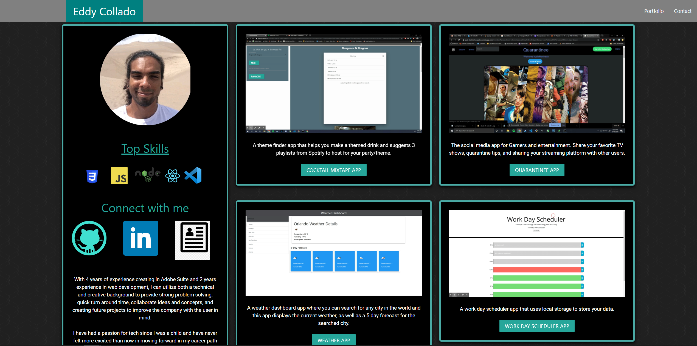

  

  
  
  
  
  

  # My React Portfolio

  ## Contributors:

  

  Eddy Collado

  * Github Username: :pizza: PhatOrbs

  * Location: Denver, Colorado

  * Email: eddcollado@gmail.com 

  * Bio: Full Stack Web Developer with a bachelors degree in Graphic Design. Strong attributes in all aspects of traditional print and modern digital design.

  ## Description 

  :cake: My portfolio created using React components, Materialize CSS libraries and deployed through GitHub pages

  

  ## Table of Contents 

  * [Installation](#installation) 

  * [Usage](#usage) 

  * [Contributors](#contributors) 

  * [License](#license) 

  * [Tests](#tests) 

  * [Questions](#questions) 

  ## Installation 

  No need to install, just click the link above to view my profile 

  ## Usage 

  :bacon: To present my line of work 

  ## License 

  :trophy: N/A 

  ## Credit 

  Phat Orbs 

  ## Contributing 

  :scorpion:  

  ## Tests 

   

  ## Questions 

   

  :key: :key: :key: :key: :key: 

